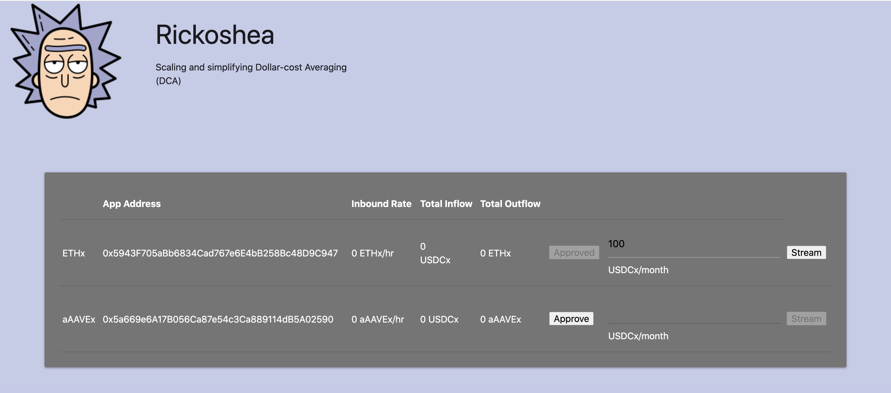

# Rickoshea
Rickoshea helps you DCA into ETH using Superfluid's ETHx and USDCx. You open a stream of USDCx to Rickoshea and you will receive a distribution of ETHx periodically. In this way, you DCA into ETHx using just a single transaction.  

## Why Rickoshea?
Rickoshea only requires one DCA transaction per period for all users, reducing collective transaction quantity exponentially.

## Architecture

# Project Structure
- **./01-Contracts** - Rickoshea's solidity contract code organized into a Hardhat project
- **./01-DApp** - A python flask application for interacting with Rickoshea
